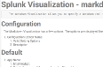

= Splunk Visualization - markdown
:prod: Aplura Visualization
:callout:

The Markdown Visualization allows you to specify a *Markdown* (md) or AsciiDoc (adoc) file to render in the browser as HTML.

:toc:

// attributions are not displayed distinctly
NOTE: This is a note.

{prod}

////
This block of text is a comment
////

// This line is a comment

// callouts break the rendering entirely

ifdef::callout[]
prices = {'apple': 0.40, 'banana': 0.50} <1>
my_purchase = {
    'apple': 1,
    'banana': 6} <2>
grocery_bill = sum(prices[fruit] * my_purchase[fruit]
                   for fruit in my_purchase) <3>
print 'I owe the grocer $%.2f' % grocery_bill <4>

<1> The price of fruit
<2> The amount of each fruit I'm purchasing
<3> Calcualting the bill for my fruit purchase
<4> Prints the cost of my fruit in a friendly way
endif::[]

// images aren't displayed

// Files are not linked for download as expected.
link:/etc/passwd[]

https://aplura.com

// THe source shading should not go across the screen

[source,splunk]
----
| makeresults
----

// The table should have lines around the cells.

[options="header",frame="topbot]
|===
|Cell in C1R1 |Cell in C2R1
|Cell in C1R2 |Cell in C2R2
|Cell in C1R3 |Cell in C2R3
|===
